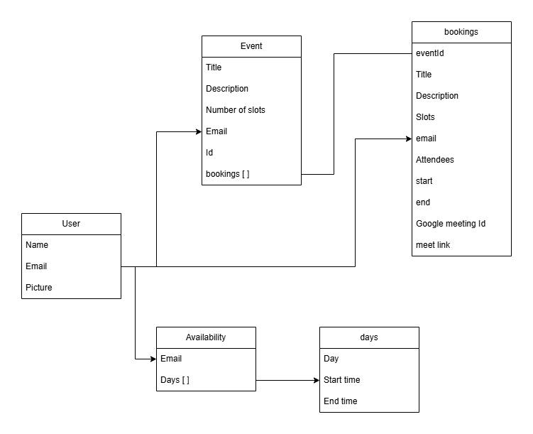

# Meet sync

A scheduling app to schedule the meeting without conflicts or overlap of the meeting.


## Run Locally

Prerequisites

- Docker
- Enable kubernetes

Install ingress nginx based on your operating system or cloud env.
[click here](https://kubernetes.github.io/ingress-nginx/deploy/) to see official documentation.

Install Skaffold based on your operating system by following steps [skaffold](https://kubernetes.github.io/ingress-nginx/deploy/)

Once the above setup is done

Clone the project

```bash
  git clone https://github.com/vinayakbhat430/meet-sync
```

Go to etc/hosts file in your system (Considering windows).
[Reference](https://www.howtogeek.com/784196/how-to-edit-the-hosts-file-on-windows-10-or-11/)
and add a line at the end.
```
127.0.0.1 meet-sync.dev
```

Once done. Just cd to the cloned repository and run
```bash
skaffold dev
```

You are ready to run and use applications locally!
go to browser and enter
https://meet-sync.dev

If you encounter any warning Just follow this [Reference](https://stackoverflow.com/questions/35274659/when-you-use-badidea-or-thisisunsafe-to-bypass-a-chrome-certificate-hsts-err)


## Why Docker and Kubernetes?

Docker and Kubernetes make it incredibly easy to set up and run applications in any environment, whether it's local development or on cloud providers. They provide a streamlined process to ensure the application behaves consistently no matter where it is deployed. Here’s why I chose to use them for this project:

### 1. Simplified Setup

One of the main reasons for using Docker and Kubernetes is the simplicity they offer when setting up complex environments. For example, instead of manually installing a database, I can use the official MongoDB Docker image available on Docker Hub. This eliminates the need for manual installation and configuration, allowing anyone to run the application without additional setup.

### 2. Portability and Ease of Use

By containerizing the application, the deployment process becomes portable and consistent. Whether I’m running the app locally or on a cloud provider, the setup remains the same. This allows me to share the project easily with others, who can simply run the Docker containers without worrying about manually configuring databases or updating code to connect to them.

### 3. Learning Opportunity

While using third-party services or cloud databases can save time, setting up Docker and Kubernetes provides valuable learning experiences. Configuring things like Docker Ingress may take more time initially, but once understood, it offers a lot of flexibility and control over deployments. This hands-on approach helps in mastering real-world infrastructure setups, especially for deployment in production environments.

### 4. Long-Term Cost Efficiency

Though third-party applications and cloud-hosted databases simplify tasks, they often come with recurring costs. For personal projects or learning purposes, using Docker and Kubernetes avoids those costs while offering complete control. Once you get comfortable with setting up these tools, you’re less likely to rely on external services, which can save money in the long run, especially for testing or educational purposes.

### Conclusion

While using Docker and Kubernetes might seem complex at first, the benefits of having a standardized, scalable, and easily shareable development environment make it worth the effort. In the long term, it provides flexibility and cost efficiency compared to third-party services.
**You will try to avoid using thridparty tools once you understand these things**


## Why MongoDB ?

**Flexibility with Data Structure**
- MongoDB (NoSQL) allows storing unstructured or semi-structured data using a flexible schema. It uses JSON-like documents where fields can vary across documents, offering more flexibility compared to the strict schema required by SQL databases.
- For projects where the data structure might evolve over time, MongoDB makes it easy to add or remove fields without affecting the entire dataset.
- Here in our case, We can add more features to the application and we may need to store more keys in the database so , In this scenario its easier to manage the evolution of the application.


## Application Flow


## Database Idea



